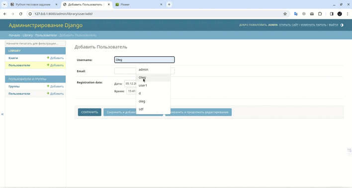

# :bookmark_tabs: Library
<p align="center">

</p>

## :pager: Стэк
- **Python**
- **Django**
- **SQLite**
- **Celery**
- **Redis**
- **Docker**
## Тестовое задание для Python-разработчика
<details>
<summary>Нажмите, чтобы посмотреть подробности</summary>

### Часть 1: Разработка Django-приложения
#### 1. Создайте Django-приложение для управления книгами в библиотеке. Каждая книга должна иметь следующие атрибуты
- Название
- Автор
- Год издания
- ISBN

#### Реализуйте REST API для управления книгами. API должно предоставлять эндпоинты для:
- Получения списка всех книг.
- Получения информации о конкретной книге.
- Создания новой книги.
- Обновления информации о книге
- Удаления книги.

### Часть 2: Работа с базой данных и Celery
#### 1. Используя Django ORM, создайте модель для хранения информации о пользователях приложения. Модель должна содержать следующие поля:
- Имя пользователя
- Электронная почта
- Дата регистрации (автоматически заполняется при создании пользователя)
#### 2. Используя Celery, реализуйте асинхронную задачу, которая отправляет приветственное электронное письмо пользователю при его регистрации.
#### 3. Обновите API для работы с пользователями, добавив эндпоинт для регистрации нового пользователя. При создании нового пользователя, задача Celery должна запускаться асинхронно для отправки приветственного письма.

### Часть 3: Работа с базой данных и Celery
#### 1. Создайте отдельную ветку для разработки новой функциональности в вашем репозитории Git. Назовите ветку, например, feature/book-management.
#### 2. Внесите несколько изменений в код, связанных с API для управления книгами. Коммиты должны быть информативными и содержательными.
### 3. Используя механизм ветвления в Git, создайте отдельную ветку для исправления ошибки в коде вашего приложения. Назовите ветку, например, bugfix/registration.
#### 4. Создайте Pull Request (или Merge Request) для слияния веток обратно в основную ветку вашего проекта. Убедитесь, что код проходит проверку тестов и успешно ревью.


### Часть 4: Работа с Docker и Redis
#### 1. Создайте Dockerfile для вашего Django-приложения. Включите все необходимые зависимости.
### 2. Создайте файл docker-compose.yml, чтобы ваше приложение могло успешно запускаться в контейнере. Включите в файл сервис для вашей базы данных MySQL и для Redis (используемого Celery в качестве брокера).
#### 3. Убедитесь, что приложение в контейнере успешно подключается к MySQL и Redis.


### Часть 5: Docker
#### 1. Разверните ваше Django-приложение в контейнерах Docker.
#### 2. Создайте Dockerfile для вашего Django-приложения. Учтите все необходимые зависимости, включая установку пакетов из файла зависимостей (requirements.txt).
#### 3. Создайте файл docker-compose.yml для контейнеризации вашего приложения. Определите сервисы для Django-приложения, базы данных MySQL и брокера сообщений Celery (Redis).
#### 4. Убедитесь, что ваше приложение в контейнере успешно подключается к базе данных MySQL и Celery внутри их собственных контейнеров.
#### 5. Добавьте команды в docker-compose.yml для инициализации базы данных и применения миграций Django при первом запуске.

#### Удостоверьтесь, что ваши контейнеры настроены таким образом, чтобы приложение успешно работало в среде Docker. 

</details>


## Установка


### 0) Установить константы в app/config/settings.py
    EMAIL_SENDER - адрес электронной почты с которого будет отправляться сообщение
    EMAIL_PASSWORD - пароль (в двухэтапной аутентификации аккаунта, создать пароли приложений) 

### 1) В директории, где расположен Dockerfile, выполнить команду: 
    docker compose up --build

### 2) Перейти по адресу
     http://127.0.0.1:8000/

###  Если нужны права администратора, то в новом окне терминала выполните команду и введите необходимые данные
    docker-compose exec django python manage.py createsuperuser
------

### Результат успешной регистрации пользователя




## Эндпоинты

### Получение списка пользователей
- URL: `/users/`
- Метод: GET
- Описание: Получить список всех пользователей.

### Добавление нового пользователя
- URL: `/users/create/`
- Метод: POST
- Описание: Добавить нового пользователя в базу данных.
- Параметры:
  - `username` (обязательный) - имя пользователя
  - `email` (обязательный) - адрес электронной почты

### Получение  всех книг 
- URL: `/books/`
- Метод: GET
- Описание: Получить список всех книг.

### Получение  книги
- URL: `/books/<int:pk>/'`
- Метод: GET, PUT, PATCH, DELETE, HEAD, OPTIONS
- Описание: обновить информацию или удалить книгу


### Создание книги
- URL: `/books/<int:pk>/'`
- Метод: POST
- Описание: создать новую книгу
- Параметры:
  - `title` (обязательный) - имя пользователя
  - `author` (обязательный) - автор 
  - `publication_year` (обязательный) - год издания
  - `ISBN` (обязательный) - уникальный номер книги
```json
  {
    "title": "the Witcher",
    "author": "Andrzej Sapkowski",
    "publication_year": 1994,
    "isbn": 978
  }
  
  Пример успешного ответа: Status: 200 OK
  
```

### Обновление книги
- URL: `/books/<int:pk>/'`
- Метод: PUT, PATCH
- Описание: создать новую книгу
```json
  Пример успешного ответа: Status: 200 OK
```

### Удаление книги
- URL: `/books/<int:pk>/'`
- Метод: DELETE
- Описание: удалить выбранную книгу по id
```json
  Пример успешного ответа: Status: 204 No Content
```


